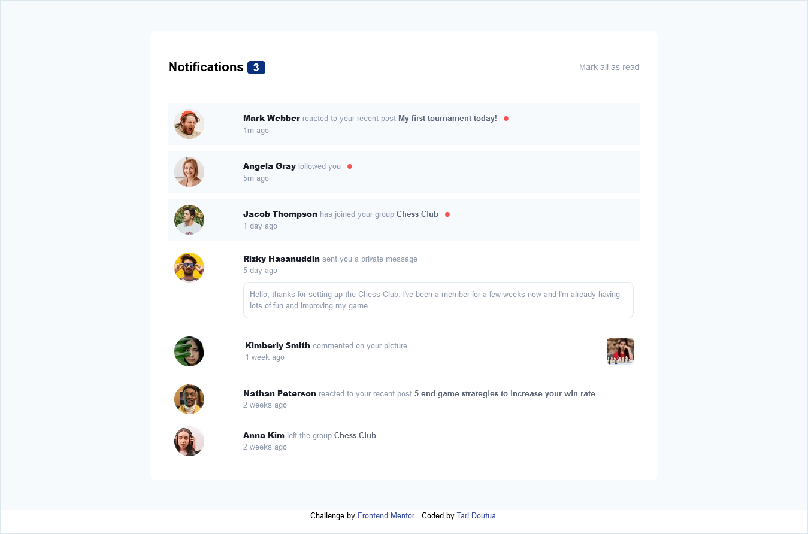

# Frontend Mentor - Notifications page solution

This is a solution to the [Notifications page challenge on Frontend Mentor](https://www.frontendmentor.io/challenges/notifications-page-DqK5QAmKbC). Frontend Mentor challenges help you improve your coding skills by building realistic projects. 

## Table of contents

  - [The challenge](#the-challenge)
  - [Screenshot](#screenshot)
  - [Links](#links)
  - [Built with](#built-with)
  - [What I learned](#what-i-learned)
  - [Continued development](#continued-development)
  - [Useful resources](#useful-resources)
- [Author](#author)

### The challenge

Users should be able to:

- Distinguish between "unread" and "read" notifications
- Select "Mark all as read" to toggle the visual state of the unread notifications and set the number of unread messages to zero
- View the optimal layout for the interface depending on their device's screen size
- See hover and focus states for all interactive elements on the page

### Screenshot



### Links

- Solution URL: [Add solution URL here](https://your-solution-url.com)
- Live Site URL: [Add live site URL here](https://your-live-site-url.com)

### Built with

- Semantic HTML5 markup
- Variable fonts
- Tailwind flexbox
- Mobile-first workflow
- [Tailwind](https://tailwind.com)Tailwind framework

### What I learned

It was really interesting working with a new skill, I built the project with a CSS framework tailwind css, so I learned how to use the tailwind css, though I'm not yet perfect using it, but I had the basic understanding on how to work with it. The project was really fun building and am looking forward on improving my skills with the tailwind css framework.

An example code of the tailwind css
```html
<h1 class="text-red-500 underline">Some HTML code I'm proud of</h1>
```

### Continued development

I'm looking forward on improving my skills on the following skills

- Tailwind css
- Tailwind css animations
- React js

### Useful resources

- [Tailwind css docs](https://www.tailwind.com/docs) - As the first time working with the tailwind framework, their documentations was really helpful to me, from installation to writing tailwind classes. So basically from start to the end of the project I made used of their documentations, so would recommend it to anyone starting off with tailwind css.

## Author

- Frontend Mentor - [@T-tech26](https://www.frontendmentor.io/profile/T-tech26)
- LinkedIn - [@tariladei-doutua](https://www.your-site.com)
- Twitter - [@TariDoutua](https://www.twitter.com/yourusername)
